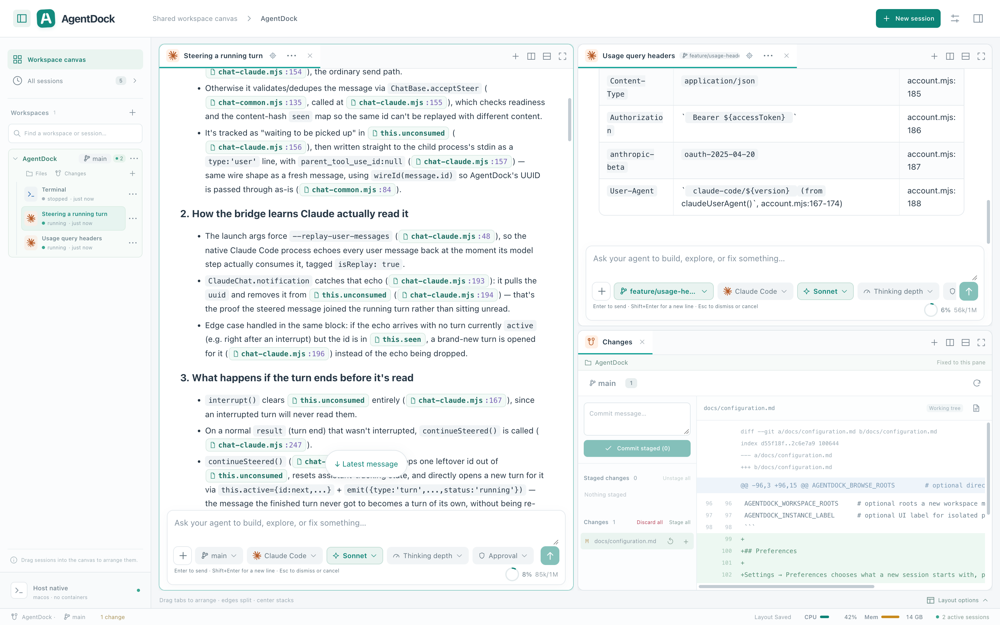
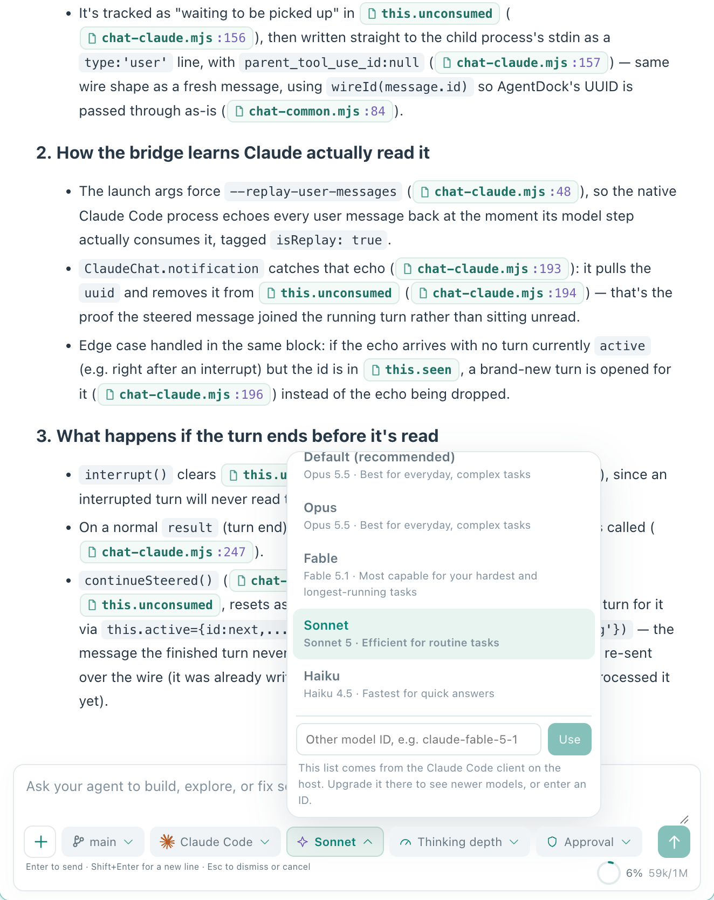
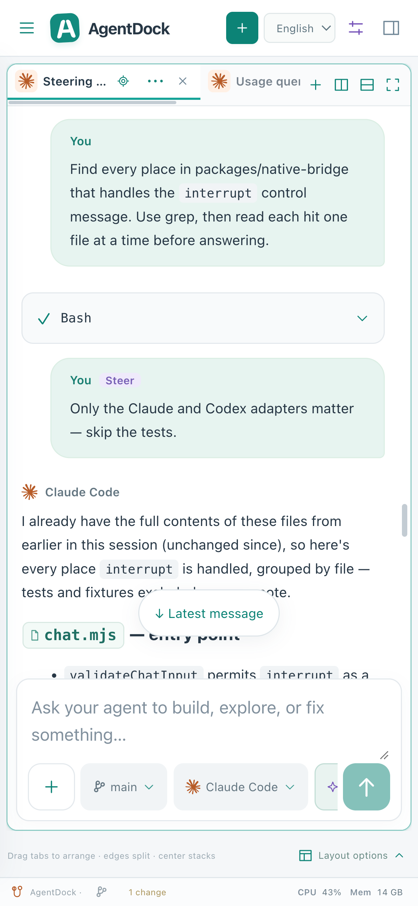

# AgentDock

<p align="center">
  <picture>
    <source media="(prefers-color-scheme: dark)" srcset="docs/assets/banner-dark.svg">
    
  </picture>
</p>

<p align="center">
  <a href="https://github.com/wnzzer/agentdock/actions/workflows/check.yml"></a>
  <a href="https://www.npmjs.com/package/@wnzzer/agentdock"></a>
  
  
  <a href="LICENSE"></a>
</p>

<p align="center"><b>English</b> · <a href="README.zh-CN.md">简体中文</a></p>

AgentDock is a browser workspace for the official **Claude Code** and **Codex** CLIs. It runs on the machine where your code lives and puts agent sessions, files, Git diffs and terminals on one canvas you can split and dock, reachable from any browser, including a phone.

It does not have its own agent. Codex is driven through its official `app-server` and Claude Code through its `stream-json` interface, so logins, models, hooks, `CLAUDE.md` and permission prompts all stay native.

<p align="center">
  
</p>

- [Highlights](#highlights)
- [Install](#install)
- [Quick start](#quick-start)
- [Commands](#commands)
- [Configuration](#configuration)
- [Remote access](#remote-access)
- [All features](#all-features)
- [Architecture](#architecture)
- [Security](#security)
- [Documentation](#documentation)
- [Development](#development)

## Highlights

### The real clients, not an imitation

Every session is the official `claude` or `codex` you already have installed, driven through its own programmatic interface. Your sign-in, `CLAUDE.md`, hooks, MCP servers, slash commands and permission prompts behave exactly as they do in the terminal. The model list comes from the client itself, so a newly released model shows up as soon as you upgrade the CLI, and you can always type a model ID by hand.

<p align="center">
  
</p>

### Any screen, full workspace

The same workspace works from a phone to an ultrawide monitor, with nothing cut down on the small end. Splits fold into tabs when a window or pane gets too small and open back up when there is room, without touching the saved layout. Controls adapt to the pane they sit in, so a narrow split on a big screen gets the compact layout too. On a phone the sidebar becomes a drawer, the layout makes room for the keyboard, menus open as bottom sheets, touch targets are finger-sized and a long press stands in for right-click. Check on a long task, answer an approval or steer the agent from the couch.

<p align="center">
  
</p>

### Correct the agent while it works

A message typed while the agent is busy doesn't have to wait. **Enter steers**: the agent reads it at its next step, without stopping, and the transcript marks it. **⌥/Alt+Enter queues** it as the next turn instead, and **Interrupt and send** stops the turn when you need to change course completely. If the client can't take a message mid-turn, it waits in the queue rather than being lost.

### One branch per session

Give a session its own branch and it moves into a git worktree beside the repository, so two agents can work on two features at once without touching each other's files. The workspace keeps its own branch, switched from the status bar. Right-click a branch or worktree to rename, delete or remove it. If a session is in the way of a switch, AgentDock names it and offers to end it for you.

### Every project on one canvas

Split, tab and dock sessions, files, Git diffs and terminals the way you like. Sessions from different repositories can sit side by side. Closing a pane never ends its process, and the layout is saved on the server, so a second browser opens exactly what you left.

### A conversation you can navigate

File paths the agent mentions (`src/app.ts:42`, `README.md`) are clickable chips that open the file at that line. Files in another workspace open there, and anything else opens in a read-only preview. Consecutive tool calls fold into one card, images open in a lightbox, and tables and code render properly.

### Hand off between agents

Stuck with one agent? Continue the same work in the other: switch from Claude Code to Codex (or back) and the conversation so far is carried into the new session's message box, ready to send.

### Your quota at a glance

Sign in to official Claude Code or Codex accounts, or import the ones already on the host, and see how much of the 5-hour and weekly windows is **left**, with the time each one resets. Several accounts can live side by side, and each new session picks one.

### Set it once

Preferences choose the default endpoint, thinking depth and permission mode per client, stored on the server so every device starts sessions the same way.

## Install

Requirements:

- Node.js 24 or newer
- [Claude Code](https://www.npmjs.com/package/@anthropic-ai/claude-code) and/or [Codex](https://www.npmjs.com/package/@openai/codex), installed on the same machine

```bash
npm install -g @wnzzer/agentdock
```

The package ships one prebuilt binary per platform, with the web client and native bridge inside it. It has no postinstall step, so `--ignore-scripts` works.

| Platform | Architectures             |
| -------- | ------------------------- |
| macOS    | arm64, x64                |
| Linux    | x64, arm64 (static musl)  |
| Other    | [Build from source](#development) |

Tarballs with `SHA256SUMS` are also attached to every [release](https://github.com/wnzzer/agentdock/releases).

## Quick start

```bash
agentdock
```

This starts the server in the background and prints its URL (by default **http://127.0.0.1:28789/**). In the browser:

1. **Pick a workspace**, which can be any existing directory on the host.
2. **Reuse your sign-in.** Go to *Settings → Official accounts → Import existing configuration*. It points at your existing `~/.claude` or `~/.codex` without copying credentials.
3. **Create a session**, or use **Load existing session** to resume a native Claude Code or Codex conversation from this workspace.
4. **Arrange the canvas** by dragging sessions, files, Git and terminals into splits and tabs.

## Commands

| Command             | Description                                                    |
| ------------------- | -------------------------------------------------------------- |
| `agentdock`         | Start the server in the background and wait until it responds  |
| `agentdock --lan`   | Same, but reachable from other machines on the network         |
| `agentdock status`  | Show whether it is running, its URL and the access token       |
| `agentdock logs`    | Print the background server's log                              |
| `agentdock restart` | Stop, then start again                                         |
| `agentdock stop`    | Stop the background server                                     |
| `agentdock serve`   | Run in the foreground (for systemd or another supervisor)      |
| `agentdock init`    | Create the state directory without starting anything           |

If a start fails, the command prints the reason from the log and exits with a non-zero code.

## Configuration

All state is stored in `~/.agentdock/` (SQLite database, settings, logs). There is no telemetry.

Settings are read from `~/.agentdock/config.toml`. An environment variable with the same meaning takes precedence over the file.

```toml
lan = true                  # same as --lan
port = 28789                # or addr = "192.168.0.9:28789"
token = "..."               # access token (AGENTDOCK_TOKEN)
allowed-origins = ["https://dock.example.com"]
```

Commonly used environment variables:

| Variable                    | Purpose                                            |
| --------------------------- | -------------------------------------------------- |
| `AGENTDOCK_HOME`            | State directory (default `~/.agentdock`)           |
| `AGENTDOCK_ADDR`            | Listen address (default `127.0.0.1:28789`)         |
| `AGENTDOCK_TOKEN`           | Access token; required for non-loopback binds      |
| `AGENTDOCK_ALLOWED_ORIGINS` | Extra allowed browser origins, comma-separated     |
| `AGENTDOCK_CLAUDE_BIN`      | Absolute path to `claude`                          |
| `AGENTDOCK_CODEX_BIN`       | Absolute path to `codex`                           |

API keys for custom endpoint profiles are stored only as references such as `env:AGENTDOCK_SECRET_WORK`, and the backend resolves them when a session launches. For the full list, see [Configuration](docs/configuration.md) and [Endpoint profiles](docs/endpoint-profiles.md).

## Remote access

By default AgentDock listens only on loopback. There are three ways to reach it from another device:

- **SSH port forwarding** is the recommended option on networks you do not control:

  ```bash
  ssh -L 28789:127.0.0.1:28789 user@server
  ```

- **`agentdock --lan`** binds every interface and issues an access token. Traffic is plain HTTP, so use it only on a trusted network.
- **An HTTPS reverse proxy** must preserve `Host` and WebSocket upgrades, and its hostname must be listed in `AGENTDOCK_ALLOWED_ORIGINS`.

See [Security and boundaries](docs/security.md#private-remote-access) for details.

## All features

**Canvas**

- Recursive horizontal and vertical splits, drag-to-edge docking, tabs, and `1:1` / `2×2` / `1:2:1` presets.
- Sessions from different projects can share one canvas; each file and Git pane stays bound to its own repository.
- Closing a pane never ends its process. Layouts are saved on the server.
- Right-click menus throughout; the browser's own menu stays only where it is useful (text, links, the terminal).

**Agent sessions**

- Structured conversation view: tool cards (grouped when consecutive), native approval and question cards, context-usage ring, turn status.
- Steer a running turn, queue for after it, or interrupt and send.
- Model, thinking depth, permission mode and endpoint switchable from the message box; the model list comes from the installed client.
- Hand a conversation to the other agent. Resume native Claude Code and Codex history per workspace.
- Clickable file references and links, image previews, Markdown tables and syntax-highlighted code.
- **Interrupt** and **End session** are separate. Input is saved before it is sent and never replayed after a disconnect.
- Archive, multi-select and delete sessions; temporary sessions for throwaway questions.

**Files and Git**

- File tree, `.gitignore`-aware workspace search, and `@path` completion in the composer.
- Syntax-highlighted editing with conflict-checked saves; Markdown, image, video, audio and PDF previews.
- Git pane with status, diff, stage/unstage, discard and commit.
- Per-session branches in their own worktrees; switch, create, rename and delete branches, and remove worktrees.

**Accounts and environment**

- Official Claude Code and Codex accounts with sign-in and remaining 5-hour and weekly quota.
- Import the host's existing configuration, or create isolated custom endpoint profiles.
- Per-session environment variables: literal values, secret references and explicit unset.
- Preferences for each client's default endpoint, thinking depth and permission mode.

**Host and access**

- Host CPU and memory in the status bar.
- Works at every size: splits fold into tabs and back as space allows, controls adapt to their pane, and phones get a drawer sidebar, keyboard-aware layout, bottom-sheet menus, touch-sized targets and long-press menus.
- English and Chinese UI.

## Architecture

```text
  Browser ── Vue 3 canvas: sessions · files · Git · terminals
     │  HTTP + WebSocket, same origin
     ▼
  agentdock-server (Rust) ─────────────── SQLite (WAL) · ~/.agentdock
     ├─ workspace / file / Git services
     ├─ PTY supervisor ──────────────────▶ host shell
     └─ native bridge (Node, JSONL)
           ├─ codex app-server ──────────▶ official Codex
           └─ claude stream-json ────────▶ official Claude Code
```

- **Server (Rust)** handles the protocol, authentication, persistence and process supervision. It does not run an agent loop.
- **Native bridge (Node)** maps each client's official interface to versioned session events, which is why Node is required.
- **Layout engine** treats agents, editors, Git and terminals as pane types.

See [Architecture](docs/architecture.md) and [Structured agent UI](docs/structured-agent-ui.md).

## Security

AgentDock is a workspace for **a single trusted user**. It is not a multi-tenant sandbox.

- Anyone who can reach the API has the permissions of the user running the server. Protect the access token like that user's credentials.
- Files are read and written only inside workspace roots. A file an agent names outside every workspace can be previewed read-only, but only inside the folder picker's browsing roots. `.git`, `.ssh`, `.agentdock`, credentials and client configuration files are refused everywhere, and deletion never follows symlinks.
- **Agent processes are not sandboxed.** `claude` and `codex` run with your full user permissions, limited only by their own permission settings.
- A non-loopback bind won't start without a token of at least 24 characters, and Origin and Host must be on the allow-list.

Read [Security and boundaries](docs/security.md) and [Permission boundary](docs/permission-boundary.md) before exposing AgentDock beyond localhost.

## Documentation

| Topic                                  | Documents                                                                                          |
| -------------------------------------- | -------------------------------------------------------------------------------------------------- |
| Configuration, credentials, environment | [Configuration](docs/configuration.md) · [Endpoint profiles](docs/endpoint-profiles.md)            |
| Official accounts                      | [Official accounts](docs/official-accounts.md)                                                     |
| Sessions and the canvas                | [Sessions and the shared canvas](docs/sessions-and-canvas.md) · [Structured agent UI](docs/structured-agent-ui.md) |
| Security                               | [Security and boundaries](docs/security.md) · [Permission boundary](docs/permission-boundary.md)   |
| HTTP API                               | [API contract](docs/api.md)                                                                        |
| Design                                 | [Architecture](docs/architecture.md) · [Product boundary](docs/product-boundary.md) · [UI design](docs/ui-design.md) |
| Upgrading                              | [Settings and update](docs/settings-update.md)                                                     |

## Development

Requirements: Rust stable 1.89+, Node.js 24+, pnpm 10.30.3.

```bash
git clone https://github.com/wnzzer/agentdock.git
cd agentdock
pnpm install --frozen-lockfile
pnpm run dev                                          # → http://127.0.0.1:5173/
```

Run a production build locally:

```bash
pnpm run build:web && cargo run -p agentdock-server   # → http://127.0.0.1:28789/
```

Run the checks before submitting changes:

```bash
cargo fmt --all -- --check
cargo clippy --workspace --all-targets -- -D warnings
cargo test --workspace
pnpm run check
```

| Path                     | Contents                                                     |
| ------------------------ | ------------------------------------------------------------ |
| `crates/server`          | HTTP/WebSocket API, daemon, security, accounts, workspace IO |
| `crates/agent-runtime`   | Process and PTY supervision                                  |
| `crates/persistence`     | SQLite store and migrations (`migrations/`)                  |
| `crates/domain`          | Shared domain model                                          |
| `packages/native-bridge` | Node JSONL bridge to Claude Code and Codex                   |
| `packages/protocol`      | DTOs and layout model shared with the client                 |
| `apps/web`               | Vue 3 + TypeScript client and layout engine                  |
| `npm/`                   | Packaging for `@wnzzer/agentdock` and platform packages      |

See [Development](docs/development.md) for more.

## License

[MIT](LICENSE). Third-party material is listed in [third-party notices](docs/third-party-notices.md).

Claude Code and Codex are products of Anthropic and OpenAI respectively. AgentDock is an independent project and is not affiliated with or endorsed by either company.
