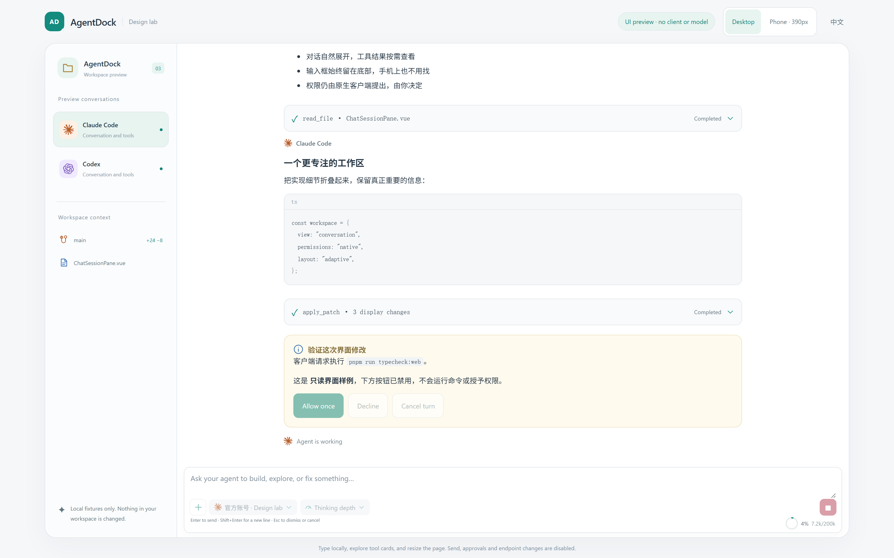
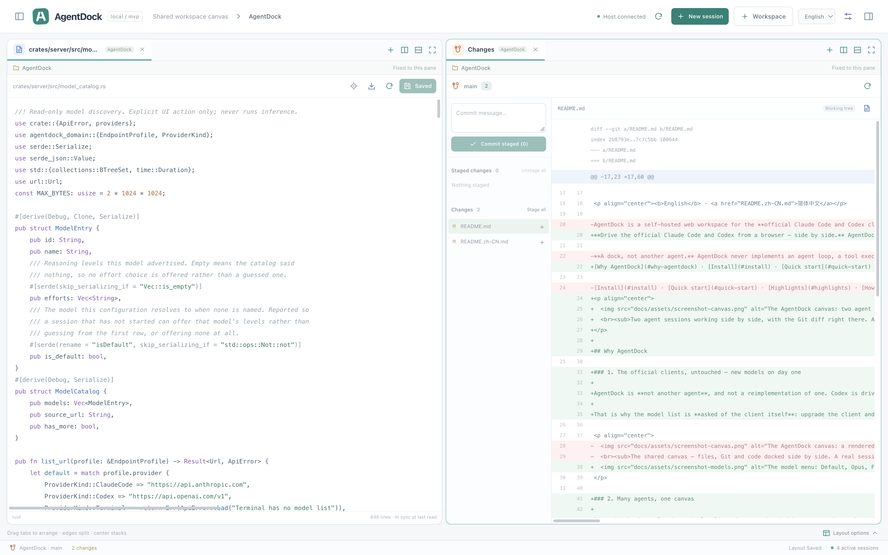

# AgentDock ⚓ — One canvas for your coding agents

<p align="center">
  <picture>
    <source media="(prefers-color-scheme: dark)" srcset="docs/assets/banner-dark.svg">
    
  </picture>
</p>

<p align="center">
  <a href="https://github.com/wnzzer/agentdock/actions/workflows/check.yml"></a>
  <a href="https://www.npmjs.com/package/@wnzzer/agentdock"></a>
  
  
  <a href="LICENSE"></a>
</p>

<p align="center"><b>English</b> · <a href="README.zh-CN.md">简体中文</a></p>

**Drive the official Claude Code and Codex from a browser — side by side.** AgentDock runs on the machine where your code lives — a laptop, a dev box, a server behind SSH — and gives every agent session, file, diff and terminal a place on one canvas you can split any way you like, from any browser, phone included. One `npm i -g`, one binary, no Docker.

[Why AgentDock](#why-agentdock) · [Install](#install) · [Quick start](#quick-start) · [Features](#features) · [How it fits together](#how-it-fits-together) · [Security](#security) · [Docs](#documentation) · [Releases](https://github.com/wnzzer/agentdock/releases)

<p align="center">
  
  <br><sub>Two agent sessions working side by side, with the Git diff right there. A real session against this repository.</sub>
</p>

## Why AgentDock

### 1. The official clients, untouched — new models on day one

AgentDock is **not another agent**, and not a reimplementation of one. Codex is driven through its official `app-server`; Claude Code through the CLI's own `stream-json` control interface. Logins, models, hooks, `CLAUDE.md` and permission prompts all stay native — AgentDock renders them as cards and forwards your decision, and it never answers one for you or reads a client's credentials. The reasoning is in [Product boundary](docs/product-boundary.md).

That is why the model list is **asked of the client itself**: upgrade the client and new models such as Fable or Opus 5.5 show up in the menu. One that has not shown up yet can be used by typing its ID.

<p align="center">
  
</p>

### 2. Many agents, one canvas

Recursive horizontal and vertical splits, drag-to-edge docking, centre-drop tabs, and `1:1` / `2×2` / `1:2:1` presets. Claude Code and Codex can work at the same time, sessions from different projects can sit side by side, and every file and Git pane stays bound to its own repository. **Closing a pane never ends its process**, and layouts live on the server, so another browser opens exactly what you left.

### 3. A conversation you can read, not terminal scrollback

Messages, folding tool cards, native approval and question cards, a context-usage ring and turn status at a glance. **Interrupt** and **End session** are separate actions; input is persisted before it is sent, so a dropped connection never runs anything twice. You can start typing while the client is still starting up.

<p align="center">
  
  <br><sub>Tool cards and native approval cards. Rendered by the built-in read-only design lab from local fixtures — no client or model involved.</sub>
</p>

### 4. Walk away from the desk, keep going on your phone

The browser is the client. With `agentdock --lan` or one SSH port forward, you can follow an agent, approve a permission and ask the next question from your phone; the composer and command list stay above the on-screen keyboard. The processes run on the host, so closing the page or losing the network changes nothing — come back and carry on.

<p align="center">
  
</p>

### 5. Files and Git within reach

A lazy file tree, workspace-wide search that honours `.gitignore`, and `@path` completion in the composer; rendered Markdown, conflict-checked editing, and image / video / PDF previews. Git is a top-level pane: read the diff, stage per file and commit without switching to a terminal to check what the agent changed.

<p align="center">
  
</p>

### 6. Nothing to migrate, and your data stays yours

*Endpoint profiles → Import existing configuration* references your existing `~/.claude` or `~/.codex`, so sessions reuse the login and settings you already have without copying a credential. Or create isolated custom endpoints whose API keys are stored only as `env:` references. All state lives in `~/.agentdock/` on your own machine, with no telemetry.

## Install

Requires **Node.js 24+**, plus [Claude Code](https://www.npmjs.com/package/@anthropic-ai/claude-code) and/or [Codex](https://www.npmjs.com/package/@openai/codex) installed on the same machine.

```bash
npm install -g @wnzzer/agentdock     # or try it once: npx @wnzzer/agentdock
```

One prebuilt binary per platform, with the web client and the native bridge inside it. npm downloads only the one matching your machine through `os`/`cpu` on optional dependencies; there is no postinstall step, so `--ignore-scripts` installs work.

| Platform | Prebuilt                    |
| -------- | --------------------------- |
| macOS    | arm64 · x64                 |
| Linux    | x64 · arm64 (static musl)   |
| Other    | [build from source](#development) |

Not using npm? Every [release](https://github.com/wnzzer/agentdock/releases) attaches tarballs with a `SHA256SUMS`.

## Quick start

```bash
agentdock            # starts in the background and prints its URL
```

Open **http://127.0.0.1:28789/**, then:

1. **Pick a workspace** — any existing directory on the host.
2. **Reuse your sign-in** — *Endpoint profiles → Import existing configuration* references your existing `~/.claude` or `~/.codex`, so new sessions use the login, model and settings you already have. Nothing is copied.
3. **Create a session**, or **Load existing session** to resume a native Claude Code / Codex conversation that belongs to this workspace.
4. **Arrange the canvas** — drag sessions, files, Git and terminals into splits and tabs.

`agentdock` behaves as a gateway: it starts a detached server, waits until that server actually answers, and returns your shell. A failed start prints the reason from the log and exits non-zero instead of leaving a silent process.

```bash
agentdock status     # URL, state and access token
agentdock logs
agentdock restart
agentdock stop
agentdock serve      # foreground — what systemd or another supervisor should run
```

## Features

### 🧩 A canvas that docks anything

- Recursive horizontal/vertical splits, drag-to-edge docking, centre-drop tabs, resize with ratio snapping, `1:1` / `2×2` / `1:2:1` presets, maximize and restore.
- Panes squeezed below 280×180 fold into tabs without overwriting the saved layout, and come back when there is room.
- One shared canvas across every workspace: sessions from different projects sit side by side, while each file and Git pane stays bound to its own repository.
- Closing a pane never ends its process. Layouts persist server-side with compare-and-swap, so two browsers cannot silently overwrite each other.

### 🤖 Official agents, structured

- Messages, folding tool cards, native approval and question cards, usage, context ring and turn status — with **Interrupt** kept separate from a confirmed **End session**.
- Searchable model picker and reasoning effort, forwarded to each client's native flags. Claude Code's plan mode passes through as-is; where Codex has no equivalent, the option is refused rather than faked.
- Resume native history per workspace with fuzzy search. Legacy PTY sessions and optional host terminals remain available, and a live PTY is never silently taken over by structured chat.
- Disconnects keep processes alive. Process state and stream state are shown separately, and input is persisted before dispatch and never replayed after an uncertain outcome.

### 📁 Files and Git, first-class

- Lazy file tree with keyboard navigation, workspace-wide search that honours `.gitignore`, and `@path` completion in the composer.
- Syntax highlighting behind the editor, rendered Markdown with source one click away, conflict-checked saves, and image / video / audio / PDF previews. Grammars load on demand.
- Git status and diff, staged/unstaged groups, per-file and all-file staging, unstaging and explicit commits — a top-level pane, not an editor afterthought.

### 🔐 Accounts, profiles and environment

- Reference the host's existing Claude Code / Codex configuration, or create isolated custom endpoint profiles with their own model and permission intent. Profile edits affect future sessions only.
- API keys are **references** such as `env:AGENTDOCK_SECRET_WORK`, resolved on the backend at launch — never typed into a form, never stored in SQLite.
- Per-session environment overlays with literal, secret-reference and explicit-unset entries; names that look like credentials are refused as literals.
- Official-account management through the official client APIs: Codex browser/device login, refresh, logout and quota; Claude usage read from the official endpoint. See [official account boundaries](docs/official-accounts.md).

### 🌐 Yours to reach

- Loopback by default. `agentdock --lan` binds every interface and issues an access token; Host / Origin / CSRF checks stay on either way.
- Chinese and English UI, with responsive layouts down to narrow screens.
- State lives in `~/.agentdock/` on your hardware: SQLite in WAL mode, `0700` configuration directories, and no telemetry.

## How it fits together

```text
  Browser ── Vue 3 canvas: sessions · files · Git · terminals
     │  HTTP + WebSocket, same origin
     ▼
  agentdock-server (Rust) ─────────────── SQLite (WAL) · ~/.agentdock
     ├─ workspace / file / Git services    paths canonicalised inside the workspace root
     ├─ PTY supervisor ──────────────────▶ host shell · legacy CLI sessions
     └─ native bridge (Node, JSONL)
           ├─ codex app-server ──────────▶ official Codex
           └─ claude stream-json ────────▶ official Claude Code
```

- The **server** owns protocol, auth, persistence and process supervision. It never executes an agent loop.
- The **native bridge** is a bounded Node subprocess that maps each client's official structured interface onto versioned session events. That is why Node is a requirement rather than an extra.
- The **layout engine** is the product core: agents, editors, Git and terminals are all just pane kinds, so new capabilities register as panes instead of reshaping the app.

More in [Architecture](docs/architecture.md) and [Structured agent UI](docs/structured-agent-ui.md).

## Remote access

```bash
agentdock --lan      # binds all interfaces, prints an access token
```

Traffic is plain HTTP, so on a network you do not control prefer SSH port forwarding —

```bash
ssh -L 28789:127.0.0.1:28789 user@server
```

— or put an HTTPS reverse proxy in front that preserves `Host` and WebSocket upgrades, and list its hostname in `AGENTDOCK_ALLOWED_ORIGINS`. Details in [Security and boundaries](docs/security.md#private-remote-access).

## Security

AgentDock is a **single trusted user's host workspace, not a multi-tenant sandbox.**

- Anyone who can reach the API has the authority of the user running the server. Treat the access token as that user's credentials.
- File access is confined to workspace roots: paths are canonicalised, `.git`, `.agentdock` and client configuration files are refused, and deletion never follows a symlink out of the tree.
- **Agent processes are not confined by any of that.** `claude` and `codex` run with your full user permissions; what they can reach is decided by their own permission settings, not by this server.
- A non-loopback bind refuses to start without a token of 24+ characters, and Origin/Host must be allow-listed.

Read [Security and boundaries](docs/security.md) and [Permission boundary](docs/permission-boundary.md) before exposing it beyond localhost.

## Documentation

| Goal                                         | Start here                                                                                                   |
| -------------------------------------------- | ------------------------------------------------------------------------------------------------------------ |
| Configure state, credentials and environment | [Configuration](docs/configuration.md) · [Endpoint profiles](docs/endpoint-profiles.md)                        |
| Sign in with official accounts               | [Official accounts](docs/official-accounts.md)                                                               |
| Understand sessions, history and the canvas  | [Sessions and the shared canvas](docs/sessions-and-canvas.md) · [Structured agent UI](docs/structured-agent-ui.md) |
| Expose it safely                             | [Security and boundaries](docs/security.md) · [Permission boundary](docs/permission-boundary.md)               |
| Integrate or script against it               | [API contract](docs/api.md)                                                                                  |
| See how it is built, and why                 | [Architecture](docs/architecture.md) · [Product boundary](docs/product-boundary.md) · [UI design](docs/ui-design.md) |
| Upgrade a running install                    | [Settings and update](docs/settings-update.md)                                                               |
| Check what has actually been verified        | [Acceptance record](docs/mvp-status.md)                                                                      |

## Development

A Cargo workspace plus a pnpm workspace: Rust stable 1.89+, Node.js 24+ and pnpm 10.30.3.

```bash
git clone https://github.com/wnzzer/agentdock.git
cd agentdock
pnpm install --frozen-lockfile
pnpm run dev         # Cargo + Vite → http://127.0.0.1:5173/
```

Production-style run and the full gate:

```bash
pnpm run build:web && cargo run -p agentdock-server    # → http://127.0.0.1:28789/

cargo fmt --all -- --check
cargo clippy --workspace --all-targets -- -D warnings
cargo test --workspace
pnpm run check
```

| Path                     | What lives there                                            |
| ------------------------ | ----------------------------------------------------------- |
| `crates/server`          | HTTP/WebSocket API, daemon, security, accounts, workspace IO |
| `crates/agent-runtime`   | Process and PTY supervision                                 |
| `crates/persistence`     | SQLite store and migrations (`migrations/`)                 |
| `crates/domain`          | Shared domain model                                         |
| `packages/native-bridge` | Node JSONL bridge to Claude Code and Codex                  |
| `packages/protocol`      | DTOs and the layout model shared with the client            |
| `apps/web`               | Vue 3 + TypeScript client and the layout engine             |
| `npm/`                   | Packaging for `@wnzzer/agentdock` and its platform packages |

See [Development](docs/development.md) for the dev loop, the read-only UI preview and deployment cautions.

## Status

AgentDock is an **MVP under active development**. It has been run locally on macOS; Linux is a CI build target, not yet a claim of a completed deployment. Implementation and fixture coverage do not mean every live provider or account flow has been exercised — what has actually been verified, and what has not, is written down in the [acceptance record](docs/mvp-status.md).

Deliberately out of scope for now: a custom agent loop, a provider reverse proxy, strong cross-process credential isolation, hunk-level staging, Git network/PR workflows, LSP and desktop control.

## License

[MIT](LICENSE). Bundled third-party material is listed in [third-party notices](docs/third-party-notices.md).

Claude Code and Codex are products of Anthropic and OpenAI respectively. AgentDock is an independent project that launches the official clients you install yourself; it is not affiliated with or endorsed by either company.
