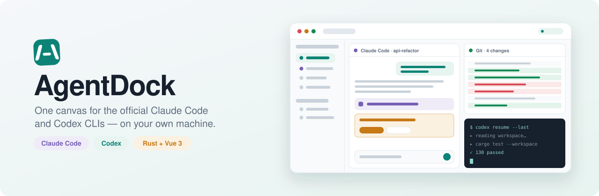
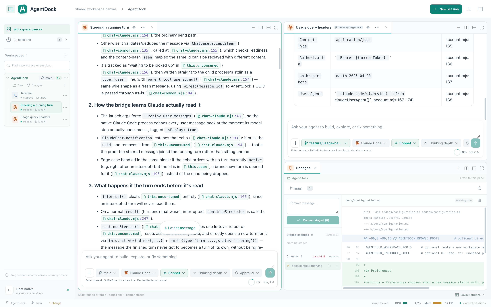
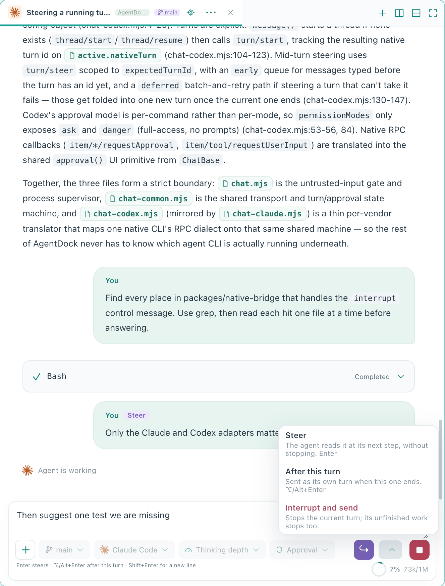
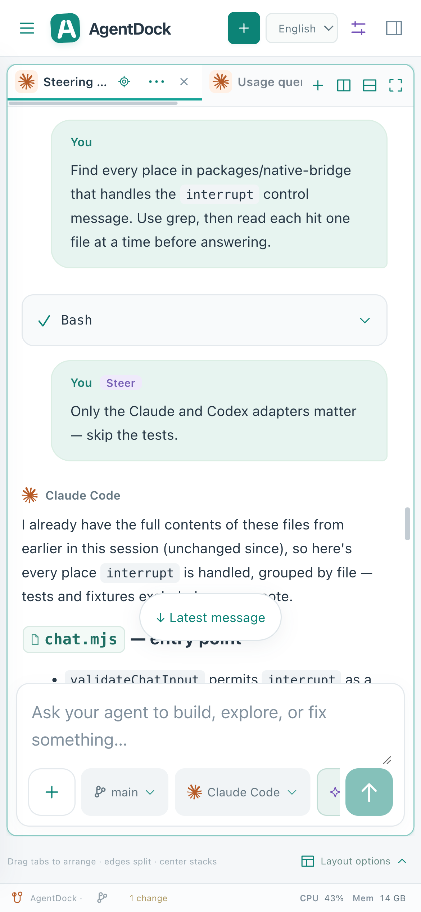

# AgentDock

<p align="center">
  <picture>
    <source media="(prefers-color-scheme: dark)" srcset="docs/assets/banner-dark.svg">
    
  </picture>
</p>

<p align="center">
  <a href="https://github.com/wnzzer/agentdock/actions/workflows/check.yml"></a>
  <a href="https://www.npmjs.com/package/@wnzzer/agentdock"></a>
  
  
  <a href="LICENSE"></a>
</p>

<p align="center"><b>English</b> · <a href="README.zh-CN.md">简体中文</a></p>

AgentDock is a browser workspace for the official **Claude Code** and **Codex** CLIs. It runs where your code lives and puts agent sessions, files, Git diffs and terminals on one canvas you can split and dock, from any browser, phone included.

It has no agent of its own: Codex runs through its official `app-server` and Claude Code through `stream-json`, so logins, models, hooks, `CLAUDE.md` and permission prompts stay native.

<p align="center">
  
</p>

## Highlights

- **The real clients.** Every session is the `claude` or `codex` you already have installed. Your sign-in, MCP servers, slash commands and permission prompts behave as in the terminal, and new models appear as soon as you upgrade the CLI.
- **Steer while it works.** <kbd>Enter</kbd> steers the running turn without stopping it, <kbd>Alt</kbd>+<kbd>Enter</kbd> queues the next turn, and *Interrupt and send* changes course.
- **Every project on one canvas.** Split, tab and dock sessions, files, diffs and terminals from different repositories. Closing a pane never ends its process, and the layout follows you to any browser.
- **One branch per session.** Give a session its own branch and it works in a git worktree, so two agents can build two features at once.
- **Accounts and endpoints, kept apart.** Each session picks an official account, the host's sign-in, a custom gateway or an isolated client home, with remaining 5-hour and weekly quota at a glance. Hand a conversation from Claude Code to Codex, or back.
- **Any screen.** Splits fold into tabs when space runs out. On a phone you get a drawer sidebar, bottom-sheet menus and long-press for right-click.

<p align="center">
  
  &nbsp;
  
</p>

<details>
<summary><b>All features</b></summary>

**Canvas**: recursive splits, drag-to-edge docking, tabs and `1:1` / `2×2` / `1:2:1` presets; each file and Git pane stays bound to its repository; layouts saved on the server; right-click menus throughout.

**Agent sessions**: structured view with grouped tool cards, native approval and question cards, a context-usage ring and turn status. Model, thinking depth, permission mode and endpoint are switchable from the message box (or type any model ID). Resume native Claude Code and Codex history per workspace. File references such as `src/app.ts:42` open at that line. Images open in a lightbox; tables and code render properly. *Interrupt* and *End session* are separate, and input is never replayed after a disconnect. Sessions can be archived, multi-selected and deleted, and temporary sessions handle throwaway questions.

**Files and Git**: file tree and editor that follow changes on disk live; `.gitignore`-aware search; `@path` completion; conflict-checked saves; Markdown, image, video, audio and PDF previews. The Git pane covers status, diff, stage, discard and commit, plus branches and worktrees.

**Accounts and environment**: official account sign-in and quota; import the host's configuration or create isolated endpoint profiles; per-session environment variables with secret references; per-client defaults stored on the server.

**Host**: CPU and memory in the status bar; English and Chinese UI.

</details>

## Quick start

Requires Node.js 24+ and [Claude Code](https://www.npmjs.com/package/@anthropic-ai/claude-code) and/or [Codex](https://www.npmjs.com/package/@openai/codex) on the same machine.

```bash
npm install -g @wnzzer/agentdock
agentdock          # starts in the background → http://127.0.0.1:28789/
```

Then **pick a workspace** (any directory on the host), reuse your sign-in from *Settings → Official accounts → Import existing configuration*, and **create a session** or **load an existing one**.

Prebuilt for macOS (arm64, x64), Linux (x64, arm64, static musl) and Windows (x64), with no postinstall step. Other platforms can [build from source](docs/development.md). On Windows, terminals open PowerShell (`AGENTDOCK_SHELL` picks another shell).

| Command | Description |
| --- | --- |
| `agentdock` / `agentdock --lan` | Start in the background, on loopback or on every interface |
| `agentdock status` · `logs` | URL, access token and server log |
| `agentdock restart` · `stop` | Restart or stop the background server |
| `agentdock serve` | Run in the foreground, for systemd or another supervisor |

## Configuration and remote access

State lives in `~/.agentdock/` (SQLite, settings, logs), with no telemetry. Settings are read from `~/.agentdock/config.toml`, and matching `AGENTDOCK_*` environment variables win:

```toml
lan = true                  # same as --lan
port = 28789                # or addr = "192.168.0.9:28789"
token = "..."               # AGENTDOCK_TOKEN
allowed-origins = ["https://dock.example.com"]
```

To reach it from another device, prefer **SSH forwarding** (`ssh -L 28789:127.0.0.1:28789 user@server`). `--lan` is plain HTTP for trusted networks only, and an **HTTPS reverse proxy** must keep `Host` and WebSocket upgrades. See [Configuration](docs/configuration.md) and [remote access](docs/security.md#private-remote-access).

> [!WARNING]
> AgentDock is for **a single trusted user**. Anyone who can reach it has your user's permissions, and `claude` / `codex` run **unsandboxed**. Read [Security and boundaries](docs/security.md) before exposing it beyond localhost.

## How it works

```text
  Browser ── Vue 3 canvas: sessions · files · Git · terminals
     │  HTTP + WebSocket, same origin
     ▼
  agentdock-server (Rust) ─────────────── SQLite (WAL) · ~/.agentdock
     ├─ workspace / file / Git services
     ├─ PTY supervisor ──────────────────▶ host shell
     └─ native bridge (Node, JSONL)
           ├─ codex app-server ──────────▶ official Codex
           └─ claude stream-json ────────▶ official Claude Code
```

The Rust server handles the protocol, auth, persistence and process supervision, and runs no agent loop itself. The Node bridge maps each client's official interface to session events.

## Documentation

[Configuration](docs/configuration.md) · [Endpoint profiles](docs/endpoint-profiles.md) · [Official accounts](docs/official-accounts.md) · [Sessions and canvas](docs/sessions-and-canvas.md) · [Structured agent UI](docs/structured-agent-ui.md) · [Agent tools](docs/agent-tools.md) · [Security](docs/security.md) · [Permission boundary](docs/permission-boundary.md) · [API](docs/api.md) · [Architecture](docs/architecture.md) · [Upgrading](docs/settings-update.md) · [Development](docs/development.md)

## Development

Requires Rust 1.89+, Node.js 24+ and pnpm 10.30.3.

```bash
pnpm install --frozen-lockfile
pnpm run dev       # → http://127.0.0.1:5173/
pnpm run check && cargo test --workspace
```

See [Development](docs/development.md) for the full check list and repository layout.

## License

[MIT](LICENSE). Third-party material is listed in [third-party notices](docs/third-party-notices.md). Claude Code and Codex are products of Anthropic and OpenAI respectively. AgentDock is an independent project and is not affiliated with or endorsed by either company.
