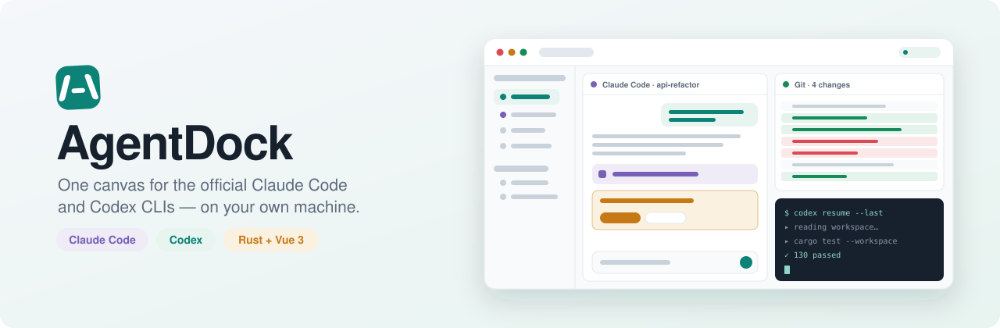
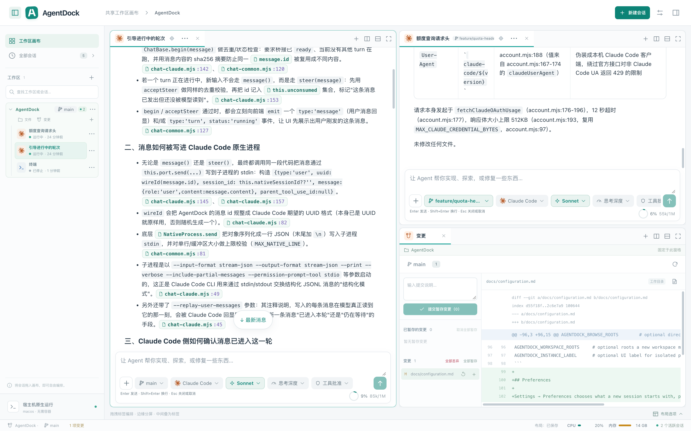
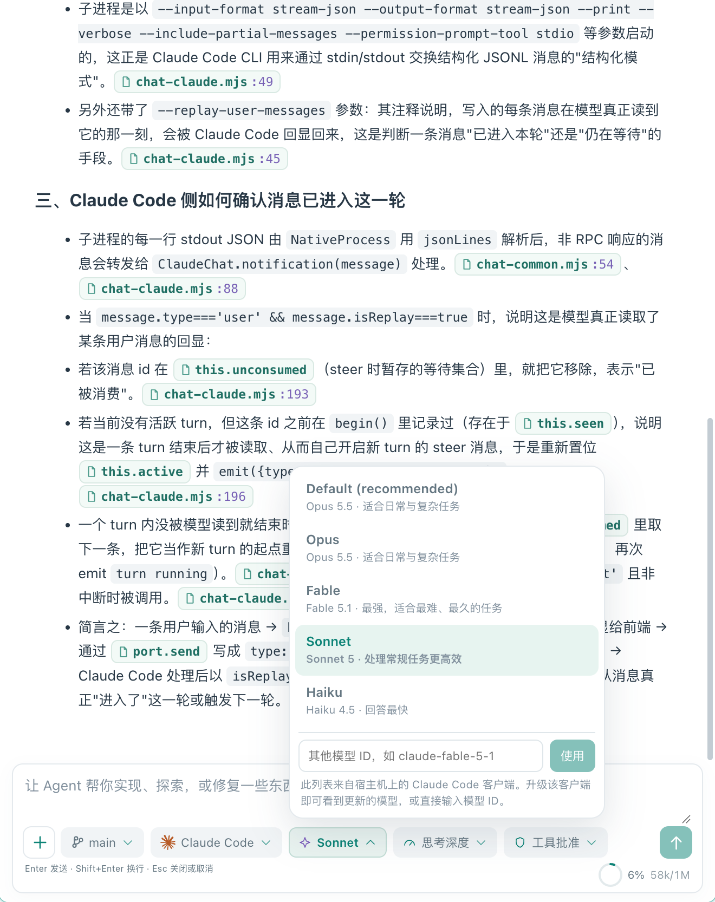
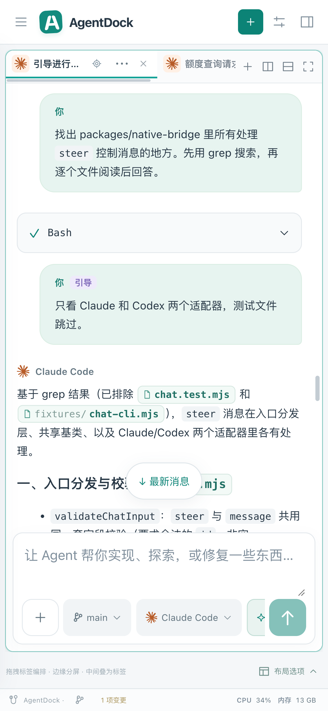

# AgentDock

<p align="center">
  <picture>
    <source media="(prefers-color-scheme: dark)" srcset="docs/assets/banner-dark.svg">
    
  </picture>
</p>

<p align="center">
  <a href="https://github.com/wnzzer/agentdock/actions/workflows/check.yml"></a>
  <a href="https://www.npmjs.com/package/@wnzzer/agentdock"></a>
  
  
  <a href="LICENSE"></a>
</p>

<p align="center"><a href="README.md">English</a> · <b>简体中文</b></p>

AgentDock 是官方 **Claude Code** 与 **Codex** CLI 的浏览器工作台。它运行在代码所在的机器上，把 Agent 会话、文件、Git diff 和终端放进一块可分屏、可停靠的画布，任何浏览器（包括手机）都能访问。

AgentDock 本身不包含 Agent：Codex 通过官方 `app-server` 驱动，Claude Code 通过其 `stream-json` 接口驱动，登录、模型、hooks、`CLAUDE.md` 和权限确认都保持原生。

<p align="center">
  
</p>

- [特色功能](#特色功能)
- [安装](#安装)
- [快速开始](#快速开始)
- [命令](#命令)
- [配置](#配置)
- [远程访问](#远程访问)
- [完整功能](#完整功能)
- [架构](#架构)
- [安全](#安全)
- [文档](#文档)
- [开发](#开发)

## 特色功能

### 用的就是官方客户端，不是仿制品

每个会话都是你本机已安装的官方 `claude` 或 `codex`，通过它们自己的编程接口驱动。登录状态、`CLAUDE.md`、hooks、MCP 服务、斜杠命令和权限确认，都和在终端里用时一模一样。模型列表直接来自客户端：新模型发布后，升级 CLI 就能看到；也可以随时手动输入模型 ID。

<p align="center">
  
</p>

### 任何尺寸都能用

从手机到带鱼屏，都是同一个完整的工作区，小屏上功能不缩水。窗口或窗格太小时，分屏会自动折叠成标签页，空间够了再展开，保存的布局不受影响。控件按所在窗格的宽度自适应，所以大屏上的窄分屏也会切换到紧凑布局。在手机上，侧边栏变成抽屉，界面会给键盘让出位置，菜单从底部弹出，按钮大小适合手指点按，长按代替右键。躺在沙发上也能看长任务的进度、批准权限，或者引导 Agent 换个方向。

<p align="center">
  
</p>

### 边做边纠正

Agent 工作时写下的消息不必干等。**Enter 引导**：不中断，Agent 下一步就会读到，聊天记录里会标出来。**⌥/Alt+Enter 排队**：等这一轮结束再作为新的一轮发出。需要彻底改方向时，用**中断并发送**。客户端当下接不了的消息会进入队列，不会丢。

### 每个会话一个分支

给会话指定自己的分支，它就会搬进仓库旁边的 git worktree。两个 Agent 可以同时开发两个功能，互不碰对方的文件。工作区目录有自己的分支，在状态栏切换。右键分支或 worktree 可以重命名、删除或移除。有会话挡住切换时，AgentDock 会列出是哪些会话，并可以一键结束后再切换。

### 所有项目在一张画布上

会话、文件、Git diff 和终端可以随意分屏、叠成标签、拖动停靠，不同仓库的会话也能并排放。关闭窗格不会结束进程。布局保存在服务端，换一个浏览器打开也是原样。

### 能“点”的对话

Agent 提到的文件路径（如 `src/app.ts:42`、`README.md`）会变成可点击的小卡片，点开直接跳到对应行。在别的工作区里的文件就在那个工作区打开，不在任何工作区的文件以只读方式预览。连续的工具调用折叠成一张卡片，图片可以点开放大，表格和代码都正常渲染。

### Agent 之间接力

一个 Agent 卡住了？换另一个接着干：从 Claude Code 切到 Codex（或反过来），之前的对话会带进新会话的输入框，发出去即可继续。

### 额度一眼看清

登录官方 Claude Code 或 Codex 账号，或者引入本机已有的配置，就能看到 5 小时窗口和本周窗口**还剩**多少，以及各自什么时候重置。多个账号可以并存，新建会话时选用哪个。

### 设置一次就好

在首选项里为每个客户端设定默认端点、思考深度和权限模式。设置保存在服务端，所有设备新建会话的方式都一样。

## 安装

要求：

- Node.js 24 及以上
- 同一台机器上已安装 [Claude Code](https://www.npmjs.com/package/@anthropic-ai/claude-code) 和/或 [Codex](https://www.npmjs.com/package/@openai/codex)

```bash
npm install -g @wnzzer/agentdock
```

每个平台对应一个预编译二进制，内含 Web 客户端和原生桥接。安装过程没有 postinstall，`--ignore-scripts` 环境也能正常安装。

| 平台  | 架构                     |
| ----- | ------------------------ |
| macOS | arm64、x64               |
| Linux | x64、arm64（静态 musl）  |
| 其他  | [从源码构建](#开发)      |

每个 [release](https://github.com/wnzzer/agentdock/releases) 也附带 tarball 和 `SHA256SUMS`。

## 快速开始

```bash
agentdock
```

该命令在后台启动服务并打印访问地址（默认 **http://127.0.0.1:28789/**）。在浏览器中：

1. **选择工作区**：宿主机上任意已有目录。
2. **复用已有登录**：进入 *设置 → 官方账号 → 引入现有配置*，它直接引用本机的 `~/.claude` 或 `~/.codex`，不复制凭据。
3. **新建会话**，或用 **加载已有会话** 恢复该工作区下原生 Claude Code / Codex 的历史对话。
4. **编排画布**：把会话、文件、Git 和终端拖成分屏或页签。

## 命令

| 命令                | 说明                                   |
| ------------------- | -------------------------------------- |
| `agentdock`         | 后台启动服务，并等待它可以响应         |
| `agentdock --lan`   | 同上，但允许局域网内其他机器访问       |
| `agentdock status`  | 查看运行状态、访问地址和访问 token     |
| `agentdock logs`    | 打印后台服务的日志                     |
| `agentdock restart` | 先停止再启动                           |
| `agentdock stop`    | 停止后台服务                           |
| `agentdock serve`   | 前台运行（用于 systemd 等进程管理器）  |
| `agentdock init`    | 只创建状态目录，不启动服务             |

启动失败时会打印日志里的原因，并以非零退出码结束。

## 配置

所有状态都存放在 `~/.agentdock/`（SQLite 数据库、设置和日志），没有任何遥测。

设置从 `~/.agentdock/config.toml` 读取；同名环境变量的优先级高于该文件。

```toml
lan = true                  # 等同于 --lan
port = 28789                # 或 addr = "192.168.0.9:28789"
token = "..."               # 访问 token（AGENTDOCK_TOKEN）
allowed-origins = ["https://dock.example.com"]
```

常用环境变量：

| 变量                        | 用途                                   |
| --------------------------- | -------------------------------------- |
| `AGENTDOCK_HOME`            | 状态目录（默认 `~/.agentdock`）        |
| `AGENTDOCK_ADDR`            | 监听地址（默认 `127.0.0.1:28789`）     |
| `AGENTDOCK_TOKEN`           | 访问 token；绑定非回环地址时必填       |
| `AGENTDOCK_ALLOWED_ORIGINS` | 额外允许的浏览器来源，逗号分隔         |
| `AGENTDOCK_CLAUDE_BIN`      | `claude` 的绝对路径                    |
| `AGENTDOCK_CODEX_BIN`       | `codex` 的绝对路径                     |

自定义端点配置的 API key 只以引用形式保存，例如 `env:AGENTDOCK_SECRET_WORK`，会话启动时才由后端解析。完整列表见[配置](docs/configuration.md)和[端点配置](docs/endpoint-profiles.md)。

## 远程访问

默认只监听回环地址。从其他设备访问有三种方式：

- **SSH 端口转发**：在不受你控制的网络上推荐使用这种方式。

  ```bash
  ssh -L 28789:127.0.0.1:28789 user@server
  ```

- **`agentdock --lan`**：绑定所有网卡并签发访问 token。流量是明文 HTTP，只在可信网络中使用。
- **HTTPS 反向代理**：代理需要保留 `Host` 和 WebSocket 升级，并把它的域名加入 `AGENTDOCK_ALLOWED_ORIGINS`。

详见[安全与边界](docs/security.md#private-remote-access)。

## 完整功能

**画布**

- 递归的水平和垂直分屏、拖到边缘停靠、标签页，以及 `1:1` / `2×2` / `1:2:1` 预设。
- 不同项目的会话可以共用一张画布，每个文件和 Git 窗格都绑定在各自的仓库。
- 关闭窗格不会结束进程；布局保存在服务端。
- 到处都有右键菜单；只在有用的地方（文字、链接、终端）保留浏览器自带的右键菜单。

**Agent 会话**

- 结构化对话视图：工具卡片（连续调用自动折叠）、原生权限与提问卡片、上下文用量环、轮次状态。
- 引导进行中的这一轮、排到这一轮之后，或中断并发送。
- 模型、思考深度、权限模式和端点都能在输入框下方切换；模型列表来自本机客户端。
- 把对话交给另一个 Agent；按工作区恢复原生 Claude Code 和 Codex 历史会话。
- 可点击的文件引用和链接、图片预览、Markdown 表格和代码高亮。
- **中断**和**结束会话**是两个独立操作。输入在发送前保存，断线后绝不会自动重发。
- 会话可归档、多选、删除；临时会话适合一次性提问。

**文件与 Git**

- 文件树、遵守 `.gitignore` 的工作区搜索，输入框里 `@路径` 补全。
- 带冲突检测的代码高亮编辑；Markdown、图片、视频、音频和 PDF 预览。
- Git 窗格：状态、diff、暂存/取消暂存、丢弃改动、提交。
- 每个会话可以有自己的分支和 worktree；切换、新建、重命名、删除分支，移除 worktree。

**账号与环境**

- 官方 Claude Code 和 Codex 账号：登录，查看 5 小时和本周剩余额度。
- 引入本机已有配置，或创建相互隔离的自定义端点配置。
- 会话级环境变量：明文值、密钥引用和显式取消。
- 首选项：每个客户端的默认端点、思考深度和权限模式。

**主机与访问**

- 状态栏显示主机 CPU 和内存占用。
- 全尺寸适配：分屏随空间折叠成标签页、再自动展开，控件按所在窗格自适应；手机上有抽屉式侧边栏、避开键盘的布局、底部弹出菜单、适合手指的按钮和长按菜单。
- 中英文界面。

## 架构

```text
  浏览器 ── Vue 3 画布：会话 · 文件 · Git · 终端
     │  HTTP + WebSocket，同源
     ▼
  agentdock-server (Rust) ─────────────── SQLite (WAL) · ~/.agentdock
     ├─ 工作区 / 文件 / Git 服务
     ├─ PTY 进程监管 ────────────────────▶ 宿主机 shell
     └─ 原生桥接 (Node, JSONL)
           ├─ codex app-server ──────────▶ 官方 Codex
           └─ claude stream-json ────────▶ 官方 Claude Code
```

- **服务端（Rust）**负责协议、鉴权、持久化和进程监管，不运行 Agent 循环。
- **原生桥接（Node）**把各客户端的官方接口映射为带版本的会话事件，所以 Node 是必需依赖。
- **布局引擎**把 Agent、编辑器、Git 和终端都当作面板类型来处理。

详见[架构](docs/architecture.md)与[结构化 Agent UI](docs/structured-agent-ui.md)。

## 安全

AgentDock 是给**单个受信任用户**使用的工作台，不是多租户沙箱。

- 能访问 API 的人拥有运行服务的用户的全部权限。请像保管该用户的凭据一样保管访问 token。
- 文件读写只在工作区根目录内进行。Agent 提到的、不在任何工作区里的文件可以只读预览，但仅限于添加工作区时能浏览的那些文件夹。`.git`、`.ssh`、`.agentdock`、凭据和客户端配置文件在任何地方都会被拒绝，删除操作不会跟随符号链接。
- **Agent 进程不受沙箱限制。**`claude` 和 `codex` 以你的完整用户权限运行，只受它们自身权限设置的约束。
- 绑定非回环地址时，没有至少 24 个字符的 token 就不会启动，并且 Origin 和 Host 必须在白名单中。

在 localhost 之外开放 AgentDock 之前，请先阅读[安全与边界](docs/security.md)和[权限边界](docs/permission-boundary.md)。

## 文档

| 主题                 | 文档                                                                                           |
| -------------------- | ---------------------------------------------------------------------------------------------- |
| 配置、凭据与环境     | [配置](docs/configuration.md) · [端点配置](docs/endpoint-profiles.md)                          |
| 官方账号             | [官方账号](docs/official-accounts.md)                                                          |
| 会话与画布           | [会话与共享画布](docs/sessions-and-canvas.md) · [结构化 Agent UI](docs/structured-agent-ui.md) |
| 安全                 | [安全与边界](docs/security.md) · [权限边界](docs/permission-boundary.md)                       |
| HTTP API             | [API 契约](docs/api.md)                                                                        |
| 设计                 | [架构](docs/architecture.md) · [产品边界](docs/product-boundary.md) · [UI 设计](docs/ui-design.md) |
| 升级                 | [设置与更新](docs/settings-update.md)                                                          |

## 开发

要求：Rust stable 1.89+、Node.js 24+、pnpm 10.30.3。

```bash
git clone https://github.com/wnzzer/agentdock.git
cd agentdock
pnpm install --frozen-lockfile
pnpm run dev                                          # → http://127.0.0.1:5173/
```

在本地运行生产构建：

```bash
pnpm run build:web && cargo run -p agentdock-server   # → http://127.0.0.1:28789/
```

提交改动前运行检查：

```bash
cargo fmt --all -- --check
cargo clippy --workspace --all-targets -- -D warnings
cargo test --workspace
pnpm run check
```

| 路径                     | 内容                                                |
| ------------------------ | --------------------------------------------------- |
| `crates/server`          | HTTP/WebSocket API、守护进程、安全、账号、工作区 IO |
| `crates/agent-runtime`   | 进程与 PTY 监管                                     |
| `crates/persistence`     | SQLite 存储与迁移（`migrations/`）                  |
| `crates/domain`          | 共享领域模型                                        |
| `packages/native-bridge` | 连接 Claude Code 与 Codex 的 Node JSONL 桥接        |
| `packages/protocol`      | 与客户端共享的 DTO 和布局模型                       |
| `apps/web`               | Vue 3 + TypeScript 客户端与布局引擎                 |
| `npm/`                   | `@wnzzer/agentdock` 及各平台包的打包脚本            |

更多内容见[开发文档](docs/development.md)。

## 许可证

[MIT](LICENSE)。第三方内容列在[第三方声明](docs/third-party-notices.md)中。

Claude Code 和 Codex 分别是 Anthropic 和 OpenAI 的产品。AgentDock 是独立项目，与这两家公司没有隶属或背书关系。
