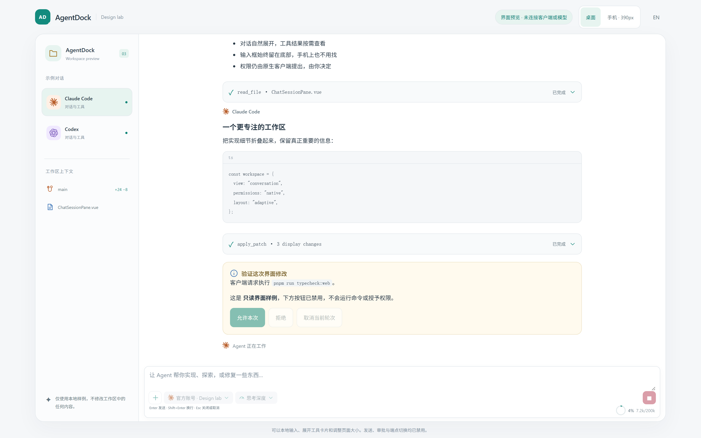
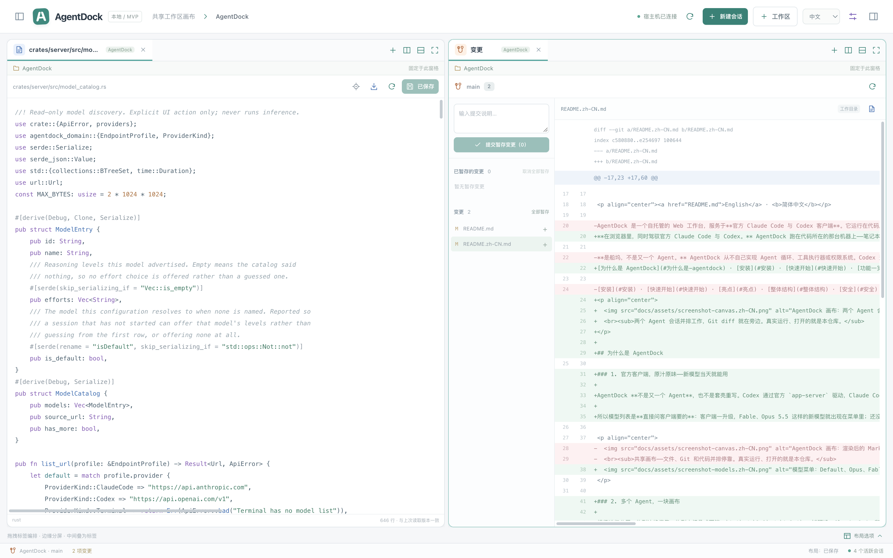

# AgentDock ⚓ — 一块画布，停靠你所有的编码 Agent

<p align="center">
  <picture>
    <source media="(prefers-color-scheme: dark)" srcset="docs/assets/banner-dark.svg">
    
  </picture>
</p>

<p align="center">
  <a href="https://github.com/wnzzer/agentdock/actions/workflows/check.yml"></a>
  <a href="https://www.npmjs.com/package/@wnzzer/agentdock"></a>
  
  
  <a href="LICENSE"></a>
</p>

<p align="center"><a href="README.md">English</a> · <b>简体中文</b></p>

**在浏览器里，同时驾驭官方 Claude Code 与 Codex。** AgentDock 跑在代码所在的那台机器上——笔记本、开发机、SSH 后面的服务器——把每个 Agent 会话、文件、diff 和终端放进同一块可以随意分屏的画布，任何浏览器都能打开，手机也行。一条 `npm i -g`，一个二进制，不需要 Docker。

[为什么是 AgentDock](#为什么是-agentdock) · [安装](#安装) · [快速开始](#快速开始) · [功能一览](#功能一览) · [整体结构](#整体结构) · [安全](#安全) · [文档](#文档) · [Releases](https://github.com/wnzzer/agentdock/releases)

<p align="center">
  
  <br><sub>两个 Agent 会话并排工作，Git diff 就在旁边。真实运行、打开的就是本仓库。</sub>
</p>

## 为什么是 AgentDock

### 1. 官方客户端，原汁原味——新模型当天就能用

AgentDock **不是又一个 Agent**，也不是套壳重写。Codex 通过官方 `app-server` 驱动，Claude Code 通过 CLI 自带的 `stream-json` 控制接口驱动。登录、模型、hooks、`CLAUDE.md`、权限确认全部是原生的——AgentDock 只把它们渲染成卡片，把你的决定转发回去，绝不替你回答，也不读客户端的凭据。背后的取舍见[产品边界](docs/product-boundary.md)。

所以模型列表是**直接问客户端要的**：客户端一升级，Fable、Opus 5.5 这样的新模型就出现在菜单里；还没出现的，也能直接输入模型 ID 先用上。

<p align="center">
  
</p>

### 2. 多个 Agent，一块画布

横竖递归分屏、拖到边缘停靠、拖到中间叠成页签、`1:1` / `2×2` / `1:2:1` 一键预设。Claude Code 和 Codex 可以同时各干各的，不同项目的会话也能并排——而每个文件、Git 面板始终绑定自己的仓库。**关掉面板不会结束进程**，布局保存在服务端，换个浏览器打开还是原样。

### 3. 看得懂的对话，而不是终端滚屏

消息、可折叠的工具卡片、原生审批与提问卡片、上下文用量环、轮次状态一目了然。**中断**和**结束会话**是两个动作；输入先落库再发送，断线也不会重复执行。打开会话时客户端还在握手，也可以先打字。

<p align="center">
  
  <br><sub>工具卡片与原生审批卡片。由内置的只读 design lab 用本地 fixture 渲染，不涉及任何客户端或模型。</sub>
</p>

### 4. 离开电脑，在手机上接着干

浏览器就是客户端。`agentdock --lan` 或一条 SSH 端口转发，就能在手机上看 Agent 进度、批准权限、追问下一步；键盘弹出时输入框和命令列表始终在键盘上方。进程跑在宿主机上，页面关了、网断了都不影响，回来接着聊。

<p align="center">
  
</p>

### 5. 文件与 Git 就在手边

懒加载文件树、遵循 `.gitignore` 的全局搜索、输入框里 `@路径` 补全；Markdown 渲染预览、带冲突检测的编辑保存、图片/视频/PDF 预览。Git 是顶级面板：看 diff、按文件暂存、提交，不用切回终端检查 Agent 改了什么。

<p align="center">
  
</p>

### 6. 零迁移，数据留在你手里

在 *端点配置 → 导入现有配置* 里引用本机的 `~/.claude` / `~/.codex`，直接复用已有登录和设置，不复制任何凭据；也可以建相互隔离的自定义端点，API key 只存 `env:` 引用。状态全在你自己机器的 `~/.agentdock/`，没有任何遥测。

## 安装

需要 **Node.js 24+**，并在同一台机器上装好 [Claude Code](https://www.npmjs.com/package/@anthropic-ai/claude-code) 和/或 [Codex](https://www.npmjs.com/package/@openai/codex)。

```bash
npm install -g @wnzzer/agentdock     # 或者先试一下：npx @wnzzer/agentdock
```

每个平台一个预编译二进制，Web 客户端和原生桥接都打在里面。npm 通过 optional dependencies 的 `os`/`cpu` 只下载匹配本机的那一个；没有 postinstall，`--ignore-scripts` 环境也能装。

| 平台  | 预编译                      |
| ----- | --------------------------- |
| macOS | arm64 · x64                 |
| Linux | x64 · arm64（静态 musl）    |
| 其他  | [从源码构建](#开发)         |

不用 npm？每个 [release](https://github.com/wnzzer/agentdock/releases) 都附带 tarball 和 `SHA256SUMS`。

## 快速开始

```bash
agentdock            # 后台启动，并打印访问地址
```

打开 **http://127.0.0.1:28789/**，然后：

1. **选一个工作区**——宿主机上任意已有目录。
2. **复用已有登录**——在 *端点配置 → 导入现有配置* 里引用本机的 `~/.claude` 或 `~/.codex`，新会话直接使用你已有的登录、模型和设置，不复制任何凭据。
3. **新建会话**，或用 **加载已有会话** 恢复属于该工作区的原生 Claude Code / Codex 历史对话。
4. **编排画布**——把会话、文件、Git 和终端拖成分屏或页签。

`agentdock` 以网关方式工作：拉起一个脱离终端的服务进程，等它真正能响应后才把 shell 还给你。启动失败会从日志里打印原因并以非零码退出，不会留下一个沉默的进程。

```bash
agentdock status     # 地址、状态和访问 token
agentdock logs
agentdock restart
agentdock stop
agentdock serve      # 前台运行——交给 systemd 等进程管理器时用这个
```

## 功能一览

### 🧩 什么都能停靠的画布

- 递归横/竖分屏、拖到边缘停靠、拖到中心成页签、带比例吸附的缩放、`1:1` / `2×2` / `1:2:1` 预设、最大化与还原。
- 面板被挤到 280×180 以下时自动折叠为页签，不覆盖已保存的布局，空间回来后原样恢复。
- 所有工作区共用一块画布：不同项目的会话可以并排，而每个文件/Git 面板始终绑定自己的仓库。
- 关闭面板永远不会结束进程。布局存在服务端并用 compare-and-swap 保存，两个浏览器不会悄悄互相覆盖。

### 🤖 官方 Agent，结构化呈现

- 消息、可折叠的工具卡片、原生审批与提问卡片、用量、上下文环和轮次状态；**中断** 与需要确认的 **结束会话** 是两个独立动作。
- 可搜索的模型选择器与思考深度，转发到各客户端的原生参数。Claude Code 的 plan 模式原样透传；Codex 没有等价能力时直接拒绝，而不是伪造一个。
- 按工作区模糊搜索并恢复原生历史。旧的 PTY 会话和可选的宿主机终端依然可用，运行中的 PTY 绝不会被结构化对话悄悄接管。
- 断线不影响进程。进程状态和流连接状态分开显示；输入先落库再发送，结果不确定时绝不自动重放。

### 📁 文件与 Git，一等公民

- 懒加载文件树与键盘导航，遵循 `.gitignore` 的全工作区搜索，输入框里支持 `@路径` 补全。
- 编辑器下的语法高亮、渲染后的 Markdown（源码一键切换）、带版本冲突检测的保存，以及图片/视频/音频/PDF 预览。语法文件按需加载。
- Git 状态与 diff、已暂存/未暂存分组、单文件与全部暂存、取消暂存、显式提交——它是顶级面板，不是编辑器的附属品。

### 🔐 账号、配置与环境

- 引用宿主机已有的 Claude Code / Codex 配置，或创建相互隔离的自定义端点配置，各自带模型和权限意图。修改配置只影响之后的新会话。
- API key 只存**引用**，例如 `env:AGENTDOCK_SECRET_WORK`，启动时才在后端解析——不填进表单，也不写进 SQLite。
- 会话级环境变量覆盖层，支持字面量、密钥引用和显式 unset；名字看起来像凭据的变量不允许用字面量。
- 通过官方客户端 API 管理官方账号：Codex 的浏览器/设备码登录、刷新、登出和额度；Claude 的用量读取自官方端点。见[官方账号边界](docs/official-accounts.md)。

### 🌐 访问权在你手里

- 默认只监听回环地址。`agentdock --lan` 绑定所有网卡并签发访问 token；Host / Origin / CSRF 检查始终开启。
- 中英文界面，窄屏下也有响应式布局。
- 状态存放在你自己机器的 `~/.agentdock/`：WAL 模式的 SQLite、`0700` 的配置目录，没有任何遥测。

## 整体结构

```text
  浏览器 ── Vue 3 画布：会话 · 文件 · Git · 终端
     │  HTTP + WebSocket，同源
     ▼
  agentdock-server (Rust) ─────────────── SQLite (WAL) · ~/.agentdock
     ├─ 工作区 / 文件 / Git 服务            路径规范化并限制在工作区根目录内
     ├─ PTY 进程监管 ────────────────────▶ 宿主机 shell · 旧版 CLI 会话
     └─ 原生桥接 (Node, JSONL)
           ├─ codex app-server ──────────▶ 官方 Codex
           └─ claude stream-json ────────▶ 官方 Claude Code
```

- **服务端**负责协议、鉴权、持久化和进程监管，从不执行 Agent 循环。
- **原生桥接**是一个受限的 Node 子进程，把各客户端的官方结构化接口映射成带版本的会话事件。这也是 Node 是硬性依赖而非可选项的原因。
- **布局引擎**是产品核心：Agent、编辑器、Git、终端都只是面板类型，新能力注册成面板即可，不用重新设计整个应用。

更多见[架构](docs/architecture.md)与[结构化 Agent UI](docs/structured-agent-ui.md)。

## 远程访问

```bash
agentdock --lan      # 绑定所有网卡，并打印访问 token
```

流量是明文 HTTP，所以在不受你控制的网络上，优先用 SSH 端口转发——

```bash
ssh -L 28789:127.0.0.1:28789 user@server
```

——或者在前面放一个保留 `Host` 和 WebSocket 升级的 HTTPS 反向代理，并把它的域名写进 `AGENTDOCK_ALLOWED_ORIGINS`。细节见[安全与边界](docs/security.md#private-remote-access)。

## 安全

AgentDock 是**单个受信任用户的宿主机工作台，不是多租户沙箱。**

- 能访问到 API 的人，就拥有运行服务的那个用户的全部权限。请把访问 token 当作该用户的凭据来保管。
- 文件访问被限制在工作区根目录内：路径会被规范化，`.git`、`.agentdock` 和客户端配置文件一律拒绝，删除操作绝不跟随符号链接跳出目录树。
- **以上限制都管不到 Agent 进程。** `claude` 和 `codex` 以你完整的用户权限运行；它们能碰到什么，由客户端自己的权限设置决定，而不是由本服务决定。
- 绑定非回环地址时，没有 24 位以上的 token 会拒绝启动，且 Origin/Host 必须在白名单里。

在暴露到 localhost 之外前，请先读[安全与边界](docs/security.md)和[权限边界](docs/permission-boundary.md)。

## 文档

| 目标                       | 从这里开始                                                                                                         |
| -------------------------- | ------------------------------------------------------------------------------------------------------------------ |
| 配置状态目录、凭据与环境   | [配置](docs/configuration.md) · [端点配置](docs/endpoint-profiles.md)                                              |
| 用官方账号登录             | [官方账号](docs/official-accounts.md)                                                                              |
| 理解会话、历史与画布       | [会话与共享画布](docs/sessions-and-canvas.md) · [结构化 Agent UI](docs/structured-agent-ui.md)                     |
| 安全地对外开放             | [安全与边界](docs/security.md) · [权限边界](docs/permission-boundary.md)                                           |
| 对接或脚本化调用           | [API 契约](docs/api.md)                                                                                            |
| 了解怎么构建的、为什么     | [架构](docs/architecture.md) · [产品边界](docs/product-boundary.md) · [UI 设计](docs/ui-design.md)                 |
| 升级正在运行的实例         | [设置与更新](docs/settings-update.md)                                                                              |
| 查看哪些东西真正验证过     | [验收记录](docs/mvp-status.md)                                                                                     |

## 开发

一个 Cargo workspace 加一个 pnpm workspace：Rust stable 1.89+、Node.js 24+、pnpm 10.30.3。

```bash
git clone https://github.com/wnzzer/agentdock.git
cd agentdock
pnpm install --frozen-lockfile
pnpm run dev         # Cargo + Vite → http://127.0.0.1:5173/
```

生产形态运行，以及完整门禁：

```bash
pnpm run build:web && cargo run -p agentdock-server    # → http://127.0.0.1:28789/

cargo fmt --all -- --check
cargo clippy --workspace --all-targets -- -D warnings
cargo test --workspace
pnpm run check
```

| 路径                     | 内容                                                |
| ------------------------ | --------------------------------------------------- |
| `crates/server`          | HTTP/WebSocket API、守护进程、安全、账号、工作区 IO |
| `crates/agent-runtime`   | 进程与 PTY 监管                                     |
| `crates/persistence`     | SQLite 存储与迁移（`migrations/`）                  |
| `crates/domain`          | 共享领域模型                                        |
| `packages/native-bridge` | 连接 Claude Code 与 Codex 的 Node JSONL 桥接        |
| `packages/protocol`      | 与客户端共享的 DTO 和布局模型                       |
| `apps/web`               | Vue 3 + TypeScript 客户端与布局引擎                 |
| `npm/`                   | `@wnzzer/agentdock` 及各平台包的打包脚本            |

开发循环、只读 UI 预览和部署注意事项见[开发文档](docs/development.md)。

## 状态

AgentDock 是一个**仍在积极开发的 MVP**。目前在 macOS 上本地运行过；Linux 是 CI 构建目标，尚不代表已完成的部署验证。有实现、有 fixture 覆盖，不等于每条真实的供应商/账号流程都跑过——哪些真正验证过、哪些没有，都记在[验收记录](docs/mvp-status.md)里。

目前刻意不做：自研 Agent 循环、供应商反向代理、强跨进程凭据隔离、hunk 级暂存、Git 网络/PR 工作流、LSP 和桌面控制。

## 许可证

[MIT](LICENSE)。打包进来的第三方内容列在[第三方声明](docs/third-party-notices.md)里。

Claude Code 和 Codex 分别是 Anthropic 和 OpenAI 的产品。AgentDock 是独立项目，只负责启动你自己安装的官方客户端，与这两家公司没有隶属或背书关系。
