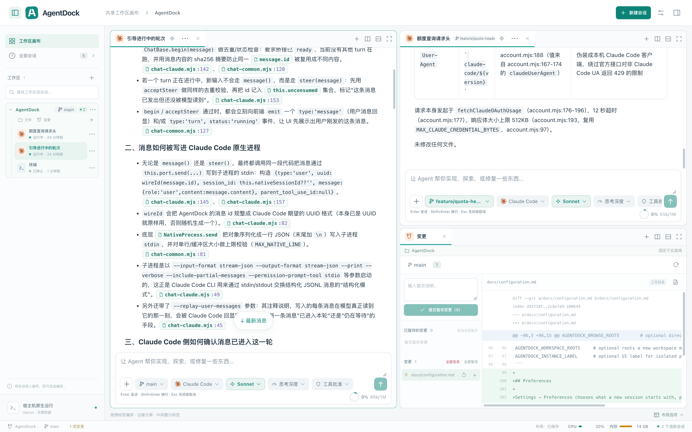
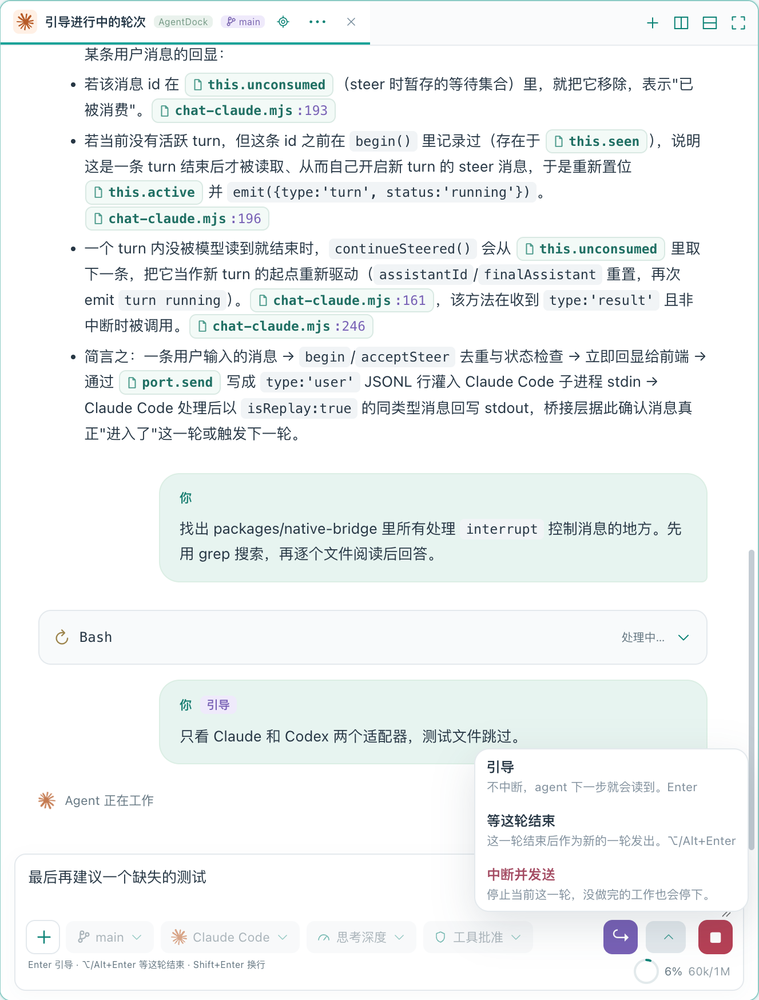
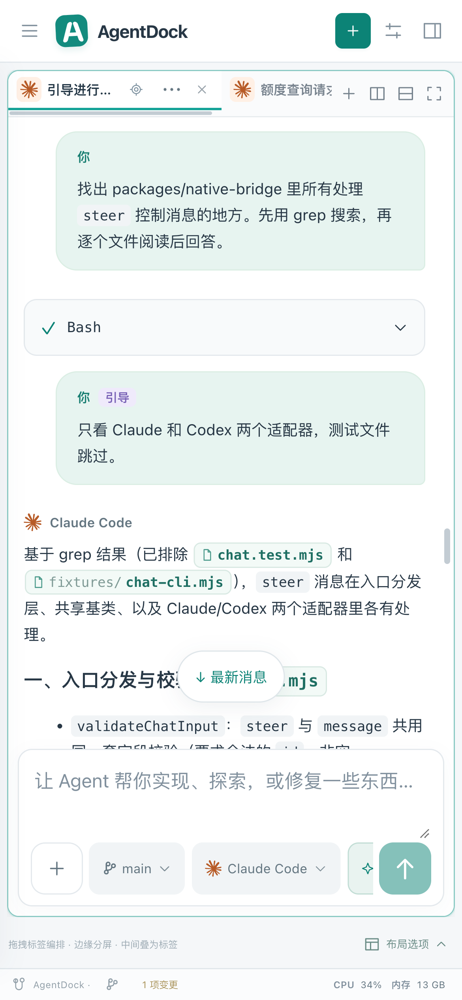

# AgentDock

<p align="center">
  <picture>
    <source media="(prefers-color-scheme: dark)" srcset="docs/assets/banner-dark.svg">
    
  </picture>
</p>

<p align="center">
  <a href="https://github.com/wnzzer/agentdock/actions/workflows/check.yml"></a>
  <a href="https://www.npmjs.com/package/@wnzzer/agentdock"></a>
  
  
  <a href="LICENSE"></a>
</p>

<p align="center"><a href="README.md">English</a> · <b>简体中文</b></p>

AgentDock 是官方 **Claude Code** 与 **Codex** CLI 的浏览器工作台。它运行在代码所在的机器上，把 Agent 会话、文件、Git diff 和终端放进一块可分屏、可停靠的画布，任何浏览器（包括手机）都能访问。

它本身不包含 Agent：Codex 通过官方 `app-server` 驱动，Claude Code 通过 `stream-json` 驱动，登录、模型、hooks、`CLAUDE.md` 和权限确认都保持原生。

<p align="center">
  
</p>

## 特色功能

- **用的就是官方客户端。** 每个会话都是你本机已安装的 `claude` 或 `codex`。登录、MCP 服务、斜杠命令和权限确认与在终端里一致，升级 CLI 就能用上新模型。
- **边做边纠正。** <kbd>Enter</kbd> 引导进行中的这一轮而不打断，<kbd>Alt</kbd>+<kbd>Enter</kbd> 排到下一轮，**中断并发送**直接改方向。
- **所有项目一张画布。** 不同仓库的会话、文件、diff 和终端随意分屏、叠标签、拖动停靠。关闭窗格不结束进程，换个浏览器打开布局照旧。
- **每个会话一个分支。** 给会话指定分支，它就在独立的 git worktree 里工作，两个 Agent 可以同时开发两个功能。
- **账号与端点彼此隔离。** 每个会话自选官方账号、本机登录、自定义网关或独立客户端环境，5 小时与本周剩余额度一目了然。还能把对话从 Claude Code 交给 Codex，或反过来。
- **任何屏幕都能用。** 空间不够时分屏自动折叠成标签页；手机上有抽屉侧边栏、底部弹出菜单，长按代替右键。

<p align="center">
  
  &nbsp;
  
</p>

<details>
<summary><b>完整功能</b></summary>

**画布**：递归分屏、拖到边缘停靠、标签页，以及 `1:1` / `2×2` / `1:2:1` 预设；每个文件和 Git 窗格绑定各自的仓库；布局保存在服务端；到处都有右键菜单。

**Agent 会话**：结构化视图，包括折叠的工具卡片、原生权限与提问卡片、上下文用量环和轮次状态。模型、思考深度、权限模式和端点在输入框下方切换（也可手动输入模型 ID）。按工作区恢复原生 Claude Code 与 Codex 历史。`src/app.ts:42` 这类文件引用点开即跳到对应行。图片可放大，表格和代码正常渲染。**中断**与**结束会话**相互独立，断线后输入绝不重发。会话可以归档、多选和删除，临时会话适合一次性提问。

**文件与 Git**：文件树和编辑器实时跟随磁盘变化；遵守 `.gitignore` 的搜索；`@路径` 补全；带冲突检测的保存；Markdown、图片、视频、音频和 PDF 预览。Git 窗格支持状态、diff、暂存、丢弃和提交，以及分支与 worktree 管理。

**账号与环境**：官方账号登录与额度；引入本机配置或创建隔离的端点配置；会话级环境变量与密钥引用；各客户端默认值保存在服务端。

**主机**：状态栏显示 CPU 与内存；中英文界面。

</details>

## 快速开始

需要 Node.js 24+，并在同一台机器上安装 [Claude Code](https://www.npmjs.com/package/@anthropic-ai/claude-code) 和/或 [Codex](https://www.npmjs.com/package/@openai/codex)。

```bash
npm install -g @wnzzer/agentdock
agentdock          # 后台启动 → http://127.0.0.1:28789/
```

然后**选择工作区**（宿主机上任意目录），在 *设置 → 官方账号 → 引入现有配置* 中复用已有登录，再**新建会话**或**加载已有会话**。

提供 macOS（arm64、x64）、Linux（x64、arm64，静态 musl）和 Windows（x64）预编译包，没有 postinstall 步骤。其他平台可[从源码构建](docs/development.md)。Windows 上终端默认打开 PowerShell（可用 `AGENTDOCK_SHELL` 指定其他 shell）。

| 命令 | 说明 |
| --- | --- |
| `agentdock` / `agentdock --lan` | 后台启动，仅本机或所有网卡 |
| `agentdock status` · `logs` | 访问地址、访问 token 与服务日志 |
| `agentdock restart` · `stop` | 重启或停止后台服务 |
| `agentdock serve` | 前台运行，用于 systemd 等进程管理器 |

## 配置与远程访问

状态保存在 `~/.agentdock/`（SQLite、设置、日志），没有任何遥测。设置读取自 `~/.agentdock/config.toml`，同名 `AGENTDOCK_*` 环境变量优先：

```toml
lan = true                  # 等同于 --lan
port = 28789                # 或 addr = "192.168.0.9:28789"
token = "..."               # AGENTDOCK_TOKEN
allowed-origins = ["https://dock.example.com"]
```

从其他设备访问时优先使用 **SSH 端口转发**（`ssh -L 28789:127.0.0.1:28789 user@server`）。`--lan` 是明文 HTTP，只适合可信网络；**HTTPS 反向代理**需要保留 `Host` 和 WebSocket 升级。详见[配置](docs/configuration.md)与[远程访问](docs/security.md#private-remote-access)。

> [!WARNING]
> AgentDock 只面向**单个受信任用户**。能访问它的人就拥有你这个用户的全部权限，且 `claude` / `codex` **不在沙箱中运行**。在 localhost 之外开放前，请先阅读[安全与边界](docs/security.md)。

## 工作原理

```text
  浏览器 ── Vue 3 画布：会话 · 文件 · Git · 终端
     │  HTTP + WebSocket，同源
     ▼
  agentdock-server (Rust) ─────────────── SQLite (WAL) · ~/.agentdock
     ├─ 工作区 / 文件 / Git 服务
     ├─ PTY 进程监管 ────────────────────▶ 宿主机 shell
     └─ 原生桥接 (Node, JSONL)
           ├─ codex app-server ──────────▶ 官方 Codex
           └─ claude stream-json ────────▶ 官方 Claude Code
```

Rust 服务端负责协议、鉴权、持久化和进程监管，自身不运行 Agent 循环；Node 桥接把各客户端的官方接口映射为会话事件。

## 文档

[配置](docs/configuration.md) · [端点配置](docs/endpoint-profiles.md) · [官方账号](docs/official-accounts.md) · [会话与画布](docs/sessions-and-canvas.md) · [结构化 Agent UI](docs/structured-agent-ui.md) · [安全](docs/security.md) · [权限边界](docs/permission-boundary.md) · [API](docs/api.md) · [架构](docs/architecture.md) · [升级](docs/settings-update.md) · [开发](docs/development.md)

## 开发

需要 Rust 1.89+、Node.js 24+ 和 pnpm 10.30.3。

```bash
pnpm install --frozen-lockfile
pnpm run dev       # → http://127.0.0.1:5173/
pnpm run check && cargo test --workspace
```

完整检查清单与目录结构见[开发文档](docs/development.md)。

## 许可证

[MIT](LICENSE)。第三方内容见[第三方声明](docs/third-party-notices.md)。Claude Code 和 Codex 分别是 Anthropic 和 OpenAI 的产品。AgentDock 是独立项目，与这两家公司没有隶属或背书关系。
