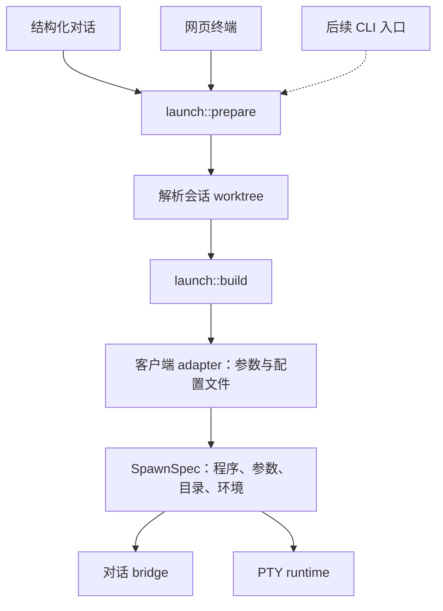

# 会话入口与终端端点

左侧列表表示持久会话，顶部 tab 表示该会话的一扇窗口。两处点击都定位到同一个会话；基础会话操作由 `SessionCommonActions.vue` 维护：重命名、环境配置、保留临时会话、复制接续命令、复制客户端会话 ID（按客户端命名，如"复制 Claude Code 会话 ID"）、运行信息。顶部 tab 右键菜单直接列出这些操作（App 经 `session-actions-context.ts` 提供）。AgentDock 会话 ID 只出现在接续命令和运行信息里，运行信息同时说明两个 ID 的用途。还没有对话时不提供复制和接续。

tab 右键保留关闭、批量关闭、分屏和最大化，并提供“会话操作”进入该 tab 的客户端菜单。关闭窗口和停止进程是两个不同的操作。刷新、终端接续和客户端视图切换目前仍由客户端视图提供；归档和删除由列表提供。后续若扩展同步范围，应让窗口和列表调用相同的会话命令，再按上下文决定是否展示，避免复制请求实现。

新增 agent 应通过客户端元数据和后端能力决定可用操作。通用会话菜单不按 Claude Code、Codex、pi 分叉；需要客户端特有参数的操作交给现有 adapter。

## 启动前配置

原生终端尚未连接时，连接页面提供当前客户端的端点选择，以及管理端点配置入口。连接按钮先保存变更，成功后才启动进程；保存失败不启动。已有原生对话更换端点需要勾选确认，因为现有 `/configuration` 接口会开启新的原生上下文，不把旧消息转发给新端点。相同端点直接接续。

普通 shell 无端点。原生历史导入和结构化会话的终端接续继续使用原配置，不在该页面切换。

## 带配置到终端

AgentDock 内终端接续现在直接复制原会话的有效配置快照、环境和 worktree，并固定原配置目录的 revision。共享端点或原会话后来修改时，已创建的接续仍指向创建时的配置。凭据保留引用，在准备启动时解析；原生账号目录仍遵循其现有共享配置语义。客户端读取方式：

| 客户端 | 配置目录 | 端点和认证 |
| --- | --- | --- |
| Claude Code | `CLAUDE_CONFIG_DIR` | `ANTHROPIC_BASE_URL`、`ANTHROPIC_API_KEY` |
| Codex | `CODEX_HOME` | 生成的 `config.toml` 指定 provider / base URL，环境提供 API key |
| pi | `PI_CODING_AGENT_DIR` | 生成的 `models.json` 指定 provider / API / base URL，环境提供 API key |

本机终端只执行原生 ID 的接续命令不能保证相同端点，也找不到对话（对话在会话自己的配置目录里）。`agentdock resume <AgentDock会话ID>` 负责这件事：CLI 不打开数据库，而是请求正在运行的服务 `POST /api/sessions/{id}/launch-plan`；服务用 `launch::continuation` 生成与网页"在终端打开"相同的启动计划（固定的配置版本、worktree、端点、模型、思考深度、权限和接续参数），但不创建会话记录；CLI 在当前终端 exec 该客户端，退出码即客户端的退出码。终端会话则在原工作目录打开 shell。接口只回应本机回环地址的连接（计划里有解析后的 Key 和本机路径），需要 `X-AgentDock-Client: cli`，并照常认证；AgentDock 正在运行的会话默认拒绝，`--force` 才开第二个客户端。界面只复制该命令，命令里只有会话 ID。

## 已抽出的共用启动层

- `launch::prepare`：解析并验证工作目录，在阻塞任务中准备配置，返回 `SpawnSpec`；不启动进程。
- `launch::build`：共用端点验证、配置目录选择、环境清理、代理、密钥引用和 AgentDock 工具注入。接续参数追加到模型、思考深度和权限参数之后，不再整体替换它们。
- `launch::terminal_reopen`：复制有效配置和原生身份，固定配置版本，验证完整启动计划后才保存临时会话。重复接续指向最初的配置目录。
- `adapters`：保留 Claude Code / Codex / pi 的参数、配置文件和协议差异；入口无需按客户端分叉。
- `providers`：保留端点校验和配置文件辅助函数；启动编排已移入 `launch`。

数据库迁移 19 为旧终端接续固定其当时可解析的配置版本。原生历史导入保持唯一，终端视图可以有多个；再次导入仍定位原记录。主动选择新端点或工作目录会开启新的原生上下文，同时清除旧接续绑定。

验证覆盖三种客户端的配置快照、凭据引用、模型、思考深度、权限和接续参数，源会话后续切换配置、重复接续、worktree 继承、导入历史、失败不留会话记录和旧库迁移。`agentdock resume` 的测试覆盖本机限定、不留记录、接续参数、运行中拒绝与 `--force`、无对话时拒绝。
